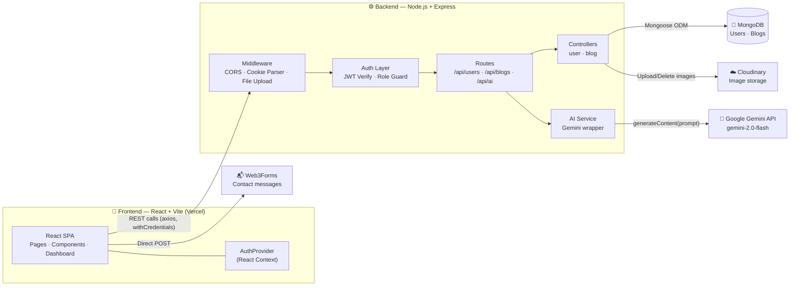
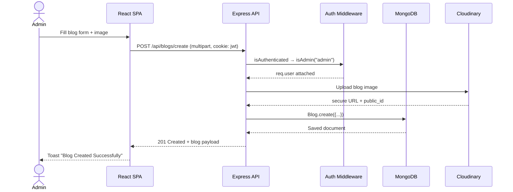

<div align="center">


# ✨ Spectral Insights

**A full-stack MERN blogging platform with AI-assisted writing, powered by Google Gemini.**

[](https://spectral-insights.vercel.app)
[](https://react.dev/)
[](https://nodejs.org/)
[](https://www.mongodb.com/)
[](https://ai.google.dev/)
[](https://tailwindcss.com/)
[](#license)

[Live Demo](https://spectral-insights.vercel.app) · [Report Bug](https://github.com/Rupeshkumar780/Spectral-Insights/issues) · [Request Feature](https://github.com/Rupeshkumar780/Spectral-Insights/issues)

</div>

---

## 📖 Overview

**Spectral Insights** is a full-stack blogging platform built on the **MERN stack** that bridges personal and professional knowledge sharing. It gives writers ("Admins") a complete authoring workflow — including **AI-powered writing assistance via the Google Gemini API** — while giving readers a clean, categorized space to discover and read blogs.

The project is split into two independently deployable services:

| Layer | Description |
|---|---|
| 🎨 **Frontend** | A React 19 + Vite single-page application styled with Tailwind CSS v4, deployed on Vercel |
| ⚙️ **Backend** | A Node.js + Express 5 REST API with MongoDB (Mongoose), deployed as a separate service |


</div>

---

## 🚀 Features

- 📝 **Full blog lifecycle** — create, read, update, and delete blogs, each with a cover image, category, and rich description
- 🤖 **AI writing assistant** — generate blog drafts and content from a text prompt using the **Gemini 2.0 Flash** model
- 🔐 **JWT-based authentication** — secure, cookie-based sessions with `httpOnly`-aware, environment-sensitive cookie settings
- 🛡️ **Role-based access control** — `user` vs `admin` roles; only admins can create, edit, or delete blogs
- ☁️ **Cloud image storage** — user avatars and blog cover images are uploaded and served via **Cloudinary**
- 🗂️ **Category-based browsing** — explore blogs by topic (e.g. Technology, Devotional, Trending, Creators)
- 👤 **Author dashboard** — manage your profile and your own published blogs from a dedicated sidebar-driven dashboard
- 📬 **Contact form** — visitor messages delivered via **Web3Forms**, no custom mail server required
- 📄 **Legal pages** — built-in Terms of Service, Privacy Policy, and Content Policy pages
- 🔔 **Toast notifications** — instant feedback on actions via `react-hot-toast`
- 📱 **Responsive UI** — carousels and layouts adapt across desktop, tablet, and mobile (`react-multi-carousel`, Tailwind)

---

## 🏗️ Architecture

Spectral Insights follows a decoupled **client–server architecture**. The React SPA never talks to MongoDB, Cloudinary, or Gemini directly — every external interaction is proxied and authorized through the Express API.



### Request flow (example: creating a blog)



### Authentication model

- On **register/login**, the backend signs a JWT (`jsonwebtoken`, 7‑day expiry) and sets it as a cookie via `createTokenAndSaveCookies`.
- Every protected route runs `isAuthenticated` (verifies the JWT and loads `req.user`) and, where needed, `isAdmin("admin")` for authorization.
- Passwords are hashed with `bcryptjs` before being persisted; the schema excludes `password` from query results by default (`select: false`).

---

## 🛠️ Tech Stack

**Frontend**
- [React 19](https://react.dev/) + [Vite 6](https://vitejs.dev/)
- [React Router v7](https://reactrouter.com/) for client-side routing
- [Tailwind CSS v4](https://tailwindcss.com/)
- [Axios](https://axios-http.com/) for HTTP requests
- [React Hook Form](https://react-hook-form.com/) for form handling
- [react-hot-toast](https://react-hot-toast.com/), [react-icons](https://react-icons.github.io/react-icons/), [react-multi-carousel](https://www.npmjs.com/package/react-multi-carousel)
- [js-cookie](https://github.com/js-cookie/js-cookie)

**Backend**
- [Node.js](https://nodejs.org/) + [Express 5](https://expressjs.com/)
- [MongoDB](https://www.mongodb.com/) with [Mongoose](https://mongoosejs.com/)
- [jsonwebtoken](https://github.com/auth0/node-jsonwebtoken) + [bcryptjs](https://github.com/dcodeIO/bcrypt.js) for auth
- [Cloudinary](https://cloudinary.com/) for image hosting (`express-fileupload` for multipart parsing)
- [@google/generative-ai](https://ai.google.dev/) — Gemini 2.0 Flash for AI text generation
- [validator](https://github.com/validatorjs/validator.js), [cookie-parser](https://github.com/expressjs/cookie-parser), [cors](https://github.com/expressjs/cors), [dotenv](https://github.com/motdotla/dotenv)
- [nodemon](https://nodemon.io/) for local development

**Third-party services**
- **MongoDB Atlas** — database hosting
- **Cloudinary** — image CDN
- **Google Gemini API** — AI content generation
- **Web3Forms** — contact form email delivery
- **Vercel** — frontend (and optionally backend) hosting

---

## 📁 Project Structure

```
Spectral-Insights/
├── backend/
│   ├── controller/
│   │   ├── blog.controller.js      # CRUD logic for blogs
│   │   └── user.controller.js      # Register, login, logout, profile
│   ├── jwt/
│   │   └── AuthToken.js            # JWT issuing + cookie helper
│   ├── middleware/
│   │   └── authUser.js             # isAuthenticated / isAdmin guards
│   ├── models/
│   │   ├── blog.model.js           # Blog schema
│   │   └── user.model.js           # User schema
│   ├── routes/
│   │   ├── aiRoutes.js             # /api/ai
│   │   ├── blog.route.js           # /api/blogs
│   │   └── user.routes.js          # /api/users
│   ├── service/
│   │   └── aiService.js            # Gemini API wrapper
│   └── index.js                    # App entry point (Express bootstrap)
│
└── frontend/
    ├── src/
    │   ├── components/              # Navbar, Footer, Home, AIGenerator
    │   ├── context/
    │   │   └── AuthProvider.jsx     # Global auth + blogs context
    │   ├── dashboard/                # SideBar, CreateBlog, UpdateBlog, MyBlogs, MyProfile
    │   ├── home/                     # Hero, Trending, Technology, Devotional, Creator
    │   ├── pages/                    # Blogs, Details, Login, Register, About, Contact, Creators, Dashboard, NotFound
    │   ├── Legal/                    # TermsOfService, PrivacyPolicy, ContentPolicy
    │   └── App.jsx                   # Route definitions
    └── vite.config.js
```

---

## 🔌 API Reference

Base URL: `<BACKEND_URL>/api`

### Users — `/api/users`

| Method | Endpoint | Auth | Description |
|---|---|---|---|
| `POST` | `/register` | Public | Register a new user (multipart form with `photo`) |
| `POST` | `/login` | Public | Log in and receive a JWT cookie |
| `GET` | `/logout` | 🔒 Required | Clear the auth cookie |
| `GET` | `/my-profile` | 🔒 Required | Get the logged-in user's profile |
| `GET` | `/admins` | Public | List all users with the `admin` role |

### Blogs — `/api/blogs`

| Method | Endpoint | Auth | Description |
|---|---|---|---|
| `GET` | `/all-blogs` | Public | Fetch every published blog |
| `GET` | `/single-blog/:id` | 🔒 Required | Fetch one blog by ID |
| `GET` | `/my-blogs` | 🔒 Admin only | Fetch blogs created by the logged-in admin |
| `POST` | `/create` | 🔒 Admin only | Create a blog (multipart form with `blogImage`) |
| `PUT` | `/update/:id` | 🔒 Admin only | Update a blog's fields and/or image |
| `DELETE` | `/delete/:id` | 🔒 Admin only | Delete a blog |

### AI — `/api/ai`

| Method | Endpoint | Auth | Description |
|---|---|---|---|
| `POST` | `/generate` | Public | Generate text from `{ prompt: string }` using Gemini 2.0 Flash |

---

## ⚙️ Getting Started

### Prerequisites

- [Node.js](https://nodejs.org/) ≥ 18
- A [MongoDB](https://www.mongodb.com/atlas) connection string
- A [Cloudinary](https://cloudinary.com/) account (cloud name, API key, API secret)
- A [Google Gemini API key](https://ai.google.dev/)
- A [Web3Forms access key](https://web3forms.com/) (only needed if you change the contact form)

### 1. Clone the repository

```bash
git clone https://github.com/Rupeshkumar780/Spectral-Insights.git
cd Spectral-Insights
```

### 2. Backend setup

```bash
cd backend
npm install
```

Create a `.env` file in `backend/`:

```env
PORT=4000
MONGO_URI=your_mongodb_connection_string
FRONTEND_URL=http://localhost:5173
JWT_SECRET_KEY=your_jwt_secret
NODE_ENV=development

CLOUD_NAME=your_cloudinary_cloud_name
CLOUD_API_KEY=your_cloudinary_api_key
API_SECRET_KEY=your_cloudinary_api_secret

GEMINI_API_KEY=your_gemini_api_key
```

```bash
npm start
```

### 3. Frontend setup

```bash
cd frontend
npm install
```

Create a `.env` file in `frontend/`:

```env
VITE_BACKEND_URL=http://localhost:4000
```

```bash
npm run dev
```

The app will be available at `http://localhost:5173`, talking to the API at `http://localhost:4000`.

---

## ☁️ Deployment

- **Frontend** is deployed on [Vercel](https://vercel.com/) as a static Vite build (`vercel.json` rewrites all routes to `index.html` for client-side routing).
- **Backend** can be deployed to any Node host (Render, Railway, Vercel Functions, etc.) — ensure `FRONTEND_URL` and cookie `sameSite`/`secure` settings match your production domains for cross-site cookies to work.
- Live instance: **[spectral-insights.vercel.app](https://spectral-insights.vercel.app)**

---

## 🗺️ Roadmap

- [ ] Add pagination/infinite scroll to the blogs listing
- [ ] Add comments/likes on individual blog posts
- [ ] Add server-side input validation (e.g. `express-validator`) alongside client-side checks
- [ ] Move `localStorage` JWT check in `App.jsx` to a fully cookie/session-driven auth check
- [ ] Add automated tests (backend integration tests, frontend component tests)

---

## 🤝 Contributing

Contributions are welcome!

1. Fork the repository
2. Create a feature branch (`git checkout -b feature/amazing-feature`)
3. Commit your changes (`git commit -m "Add amazing feature"`)
4. Push to the branch (`git push origin feature/amazing-feature`)
5. Open a Pull Request

---

## 👤 Author

**Rupesh Kumar**
· B.Tech Electrical Engineering, IIT (ISM) Dhanbad

- GitHub: [@Rupeshkumar780](https://github.com/Rupeshkumar780)
